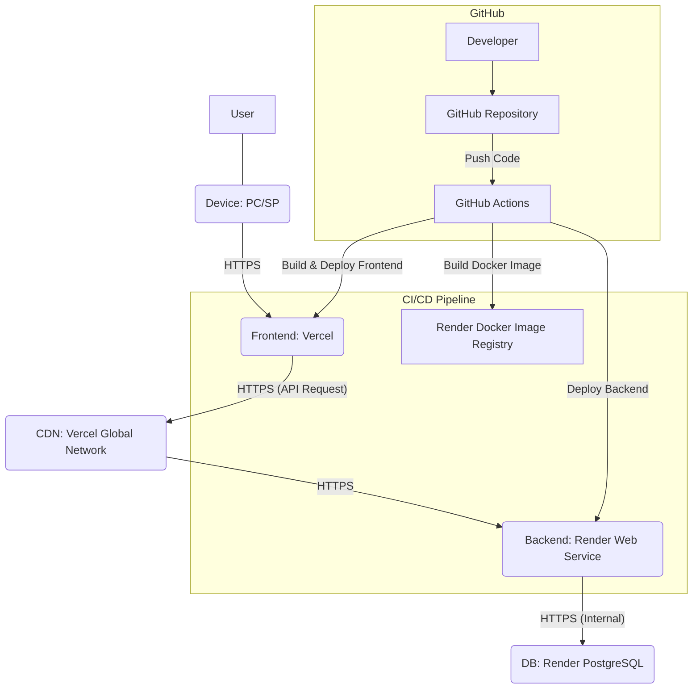

# Web サービス「Sweet Sprouts」アーキテクチャ設計書

## 1\. 概要

本ドキュメントは、子育て記録アプリ「Sweet Sprouts」のシステムアーキテクチャを定義します。ユーザーが操作するフロントエンド、ビジネスロジックを処理するバックエンド、データを永続化するデータベースの主要な 3 層構造を中心に、開発からデプロイまでのプロセスを含めた全体像を示します。スケーラビリティ、セキュリティ、運用コストの最適化を考慮した設計とします。

## 2\. 全体像の概念図

Sweet Sprouts の各コンポーネントがどのように連携するかを示す概念図です。

## 3\. 各コンポーネントの詳細

### 3.1. クライアント (ユーザーデバイス)

- **役割**: ユーザーが直接操作するインターフェースを提供します。Web ブラウザ（PC/スマートフォン）を通じてアクセスされます。
- **特性**: 特定の技術スタックは持たず、HTTP/HTTPS プロトコルを通じてフロントエンドと通信します。

### 3.2. フロントエンド

- **役割**: ユーザーインターフェース（UI）の表示、ユーザーからの入力受付、入力データの初期バリデーション、バックエンド API へのリクエスト送信、およびレスポンスの表示を行います。認証情報の管理（JWT トークンの保存・送付）も担当します。
- **技術スタック**:
  - **フレームワーク**: **React** (TypeScript)
  - **UI ライブラリ**: **Tailwind CSS**
  - **状態管理**: **Zustand**
  - **API 呼び出し**: **Axios**
  - **データフェッチング**: **SWR**
  - **ルーティング**: **React Router DOM**
  - **フォーム管理**: **React Hook Form**
  - **バリデーション**: **Zod** (バックエンドと共通スキーマ)
  - **自動テスト**: **Vitest + React Testing Library** (ユニット/結合), **Playwright** (E2E)
  - **Linter/Formatter**: **ESLint**, **Prettier**
- **ホスティング**: **Vercel**
  - 静的ファイルをホスティングし、Vercel のグローバル CDN を通じて高速に配信されます。
  - GitHub との連携により、コードプッシュ時に自動でビルドおよびデプロイが行われます。

### 3.3. バックエンド (API サーバー)

- **役割**: フロントエンドからの API リクエストを受け付け、ビジネスロジック（ユーザー認証、お子さん情報・記録の CRUD 操作、権限チェックなど）を実行します。データベースとの連携を通じてデータの永続化と取得を行います。
- **技術スタック**:
  - **フレームワーク**: **Node.js (Express.js)**
  - **言語**: **TypeScript**
  - **データベース ORM**: **Prisma**
  - **認証**: **JWT (JSON Web Tokens) + bcrypt.js** (パスワードハッシュ化)
  - **バリデーション**: **Zod** (フロントエンドと共通スキーマ)
  - **自動テスト**: **Vitest** (ユニット/結合), **Supertest** (API)
  - **Linter/Formatter**: **ESLint**, **Prettier**
- **コンテナ化**: **Docker**
  - アプリケーションは Docker コンテナとしてパッケージ化され、環境依存性を低減し、デプロイプロセスを標準化します。
- **ホスティング**: **Render Web Services**
  - Docker コンテナをデプロイし、ウェブサービスとして公開します。
  - リクエストがない間は自動的にスピンダウンし、コストを最小限に抑えます（コールドスタートの可能性あり）。
  - 自動的に HTTPS が提供されます。GitHub 連携により、コードプッシュ時に自動デプロイが可能です。

### 3.4. データベース

- **役割**: アプリケーションの永続的なデータを安全に保存・管理します。ユーザー情報、お子さん情報、授乳・排泄記録およびその詳細（授乳の開始/終了時刻を含む）が格納されます。
- **技術スタック**:
  - **データベースシステム**: **PostgreSQL**
  - **データベースクライアント**: **Prisma Client** (Prisma ORM に同梱)
  - **マイグレーションツール**: **Prisma Migrate** (Prisma ORM に同梱)
- **ホスティング**: **Render Managed PostgreSQL Database**
  - Render が提供するフルマネージド型の PostgreSQL データベースです。
  - バックアップ、スケーリング、パッチ適用などの運用作業は Render が担当します。
  - 無料枠が提供されており、MVP 段階でのコストを抑えられます。
  - バックエンドサービスとの内部ネットワーク接続により、セキュアかつ高速なデータアクセスが可能です。

## 4\. 開発・デプロイプロセス (CI/CD)

- **バージョン管理**: **Git (GitHub Repository)**
  - 全てのソースコード（フロントエンド、バックエンド、ドキュメント）を一元的に管理します。
- **CI/CD ツール**: **GitHub Actions**
  - 開発者が GitHub リポジトリにコードをプッシュすると、GitHub Actions がトリガーされます。
  - **フロントエンド**: 自動テストを実行後、ビルドを行い、Vercel へ自動デプロイします。
  - **バックエンド**: 自動テストを実行後、Docker イメージをビルドし、Render の Web Services へ自動デプロイします。
- **パッケージマネージャー**: **npm**
  - プロジェクト全体の依存関係管理に使用します。

## 5\. セキュリティとネットワーク

- **HTTPS (SSL/TLS)**: フロントエンドとバックエンド間の全ての通信は HTTPS で行われます。Vercel および Render は、自動的に SSL 証明書を提供し、安全な通信を保証します。
- **トークンベース認証**: JWT (JSON Web Tokens) を使用し、ユーザーはログイン成功後、アクセスを許可するトークンを受け取ります。このトークンは以降の API リクエストに付与されます。
- **ロールベース認可**: 各 API エンドポイントでは、リクエスト元のユーザーのロール（Admin, Guardian, Viewer）を確認し、そのロールに応じた権限チェックを行います。これにより、不正なデータアクセスや操作を防止します。
- **パスワードハッシュ化**: `bcrypt.js` を使用し、データベースに保存されるパスワードは不可逆なハッシュ値として管理され、セキュリティが強化されます。
- **データベースアクセス制限**: データベースへのアクセスは、バックエンドサービスからの内部ネットワーク接続のみに制限され、外部からの直接アクセスは遮断されます。

## 6\. コスト最適化

- **無料枠の最大限活用**: Vercel の静的ホスティング、Render の Web Services（アイドル時のスピンダウン機能）、Render の PostgreSQL 無料枠を積極的に活用し、MVP 段階での運用コストを限りなくゼロに近づけます。
- **従量課金モデル**: 各ホスティングサービスは無料枠超過後も使用量に応じた従量課金制を採用しており、初期の低コスト運用と将来的なスケーリング時の費用予測を容易にします。

---
