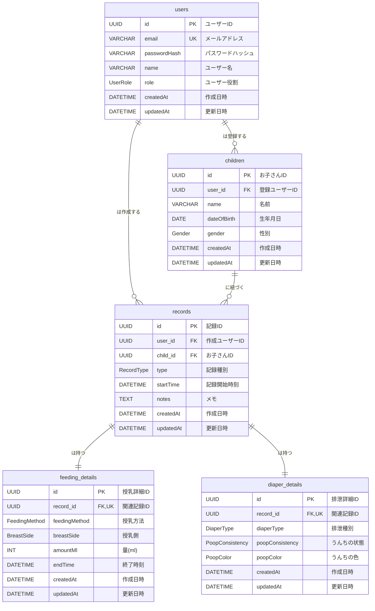

# Web サービス「Sweet Sprouts」データベース設計書

## 1\. 概要

本ドキュメントは、Web サービス「Sweet Sprouts」の永続データを格納するためのデータベーススキーマを定義します。PostgreSQL をリレーショナルデータベースとして採用し、Prisma ORM を用いてスキーマを管理します。ユーザー、お子さん、および各種育児記録の情報を効率的かつ整合性高く管理するためのテーブル構造とリレーションシップを詳述します。

## 2\. テーブルの定義

### 2.1. `users` テーブル (ユーザー情報)

システムを利用するユーザーの基本情報を格納します。ユーザーの役割を定義する `role` カラムを含みます。

| フィールド名    | データ型           | 制約                                                                 | 説明                                            |
| :-------------- | :----------------- | :------------------------------------------------------------------- | :---------------------------------------------- |
| `id`            | `String` (`UUID`)  | `@id`, `@default(uuid())`                                            | ユーザーを一意に識別する UUID                   |
| `email`         | `String`           | `@unique`                                                            | ユーザーのメールアドレス（ログイン用）          |
| `passwordHash`  | `String`           |                                                                      | パスワードのハッシュ値                          |
| `name`          | `String`           |                                                                      | ユーザー名                                      |
| `role`          | `UserRole` Enum    | `@default("GUARDIAN")`                                               | ユーザーの役割 (`ADMIN`, `GUARDIAN`, `VIEWER`)  |
| `createdAt`     | `DateTime`         | `@default(now())`                                                    | レコード作成日時                                |
| `updatedAt`     | `DateTime`         | `@updatedAt`                                                         | レコード最終更新日時                            |

**`UserRole` Enum**

- `ADMIN`: 管理者
- `GUARDIAN`: 保護者（デフォルト）
- `VIEWER`: 閲覧者

### 2.2. `children` テーブル (お子さん情報)

複数のお子さんを管理するためのテーブルです。各お子さんは 1 人のユーザーに紐づきます。

| フィールド名   | データ型           | 制約                                                                   | 説明                                                         |
| :------------- | :----------------- | :--------------------------------------------------------------------- | :----------------------------------------------------------- |
| `id`           | `String` (`UUID`)  | `@id`, `@default(uuid())`                                              | お子さんを一意に識別する ID                                  |
| `userId`       | `String`           | `@map("user_id")`                                                      | このお子さんを登録したユーザーの ID (`users.id`への外部キー) |
| `name`         | `String`           |                                                                        | お子さんの名前                                               |
| `dateOfBirth`  | `DateTime`         | `@db.Date`                                                             | 生年月日                                                     |
| `gender`       | `Gender` Enum      |                                                                        | 性別 (`MALE`, `FEMALE`, `UNKNOWN`)                           |
| `createdAt`    | `DateTime`         | `@default(now())`                                                      | レコード作成日時                                             |
| `updatedAt`    | `DateTime`         | `@updatedAt`                                                           | レコード最終更新日時                                         |

**`Gender` Enum**

- `MALE`: 男性
- `FEMALE`: 女性
- `UNKNOWN`: 不明

### 2.3. `records` テーブル (記録の共通情報)

育児記録全般に共通する情報を格納します。特定のお子さん (`childId`) とユーザー (`userId`) に紐づきます。
具体的な記録の種類（授乳、おむつなど）に応じた詳細は、別途専用のテーブルで管理されます。

| フィールド名  | データ型           | 制約                                                           | 説明                                                                           |
| :------------ | :----------------- | :------------------------------------------------------------- | :----------------------------------------------------------------------------- |
| `id`          | `String` (`UUID`)  | `@id`, `@default(uuid())`                                      | 記録を一意に識別する ID                                                        |
| `userId`      | `String`           | `@map("user_id")`                                              | 記録を作成したユーザーの ID (`users.id`への外部キー)                           |
| `childId`     | `String`           | `@map("child_id")`                                             | この記録が紐づくお子さんの ID (`children.id`への外部キー)                      |
| `type`        | `RecordType` Enum  |                                                                | 記録の種類 (`FEEDING`, `DIAPER`, `SLEEP`, `BATH`, `MEDICINE`, `WALK`, `OTHER`) |
| `startTime`   | `DateTime`         |                                                                | 記録発生時刻 (授乳の場合は開始時刻)                                            |
| `notes`       | `String`           | `?` (nullable), `@db.Text`                                     | 記録に関する自由なメモ                                                         |
| `createdAt`   | `DateTime`         | `@default(now())`                                              | レコード作成日時                                                               |
| `updatedAt`   | `DateTime`         | `@updatedAt`                                                   | レコード最終更新日時                                                           |

**`RecordType` Enum**

- `FEEDING`: 授乳
- `DIAPER`: おむつ
- `SLEEP`: 睡眠
- `BATH`: 入浴
- `MEDICINE`: 投薬
- `WALK`: 散歩
- `OTHER`: その他

### 2.4. `feeding_details` テーブル (授乳記録の詳細情報)

授乳記録に特化した詳細情報を格納します。`records` テーブルの `startTime` を開始時刻とし、別途 `endTime` を持ちます。

| フィールド名     | データ型             | 制約                                                                         | 説明                                                     |
| :--------------- | :------------------- | :--------------------------------------------------------------------------- | :------------------------------------------------------- |
| `id`             | `String` (`UUID`)    | `@id`, `@default(uuid())`                                                    | 授乳詳細を一意に識別する ID                              |
| `recordId`       | `String`             | `@unique`, `@map("record_id")`                                               | 関連する `records.id` への外部キー                       |
| `feedingMethod`  | `FeedingMethod` Enum | `@map("feeding_method")`                                                     | 授乳方法 (`DIRECT_BREAST`, `PUMPED_BREAST`, `FORMULA`)   |
| `breastSide`     | `BreastSide` Enum    | `?` (nullable), `@map("breast_side")`                                        | 直接授乳の左右 (`LEFT`, `RIGHT`, `BOTH`)                 |
| `amountMl`       | `Int`                | `?` (nullable), `@map("amount_ml")`                                          | ミルク/搾乳の量 (ml)                                     |
| `endTime`        | `DateTime`           |                                                                              | 授乳記録の終了時刻                                       |
| `createdAt`      | `DateTime`           | `@default(now())`                                                            | レコード作成日時                                         |
| `updatedAt`      | `DateTime`           | `@updatedAt`                                                                 | レコード最終更新日時                                     |

**`FeedingMethod` Enum**

- `DIRECT_BREAST`: 直接授乳
- `PUMPED_BREAST`: 搾乳
- `FORMULA`: 粉ミルク

**`BreastSide` Enum**

- `LEFT`: 左
- `RIGHT`: 右
- `BOTH`: 両方

### 2.5. `diaper_details` テーブル (排泄記録の詳細情報)

排泄記録に特化した詳細情報を格納します。

| フィールド名       | データ型               | 制約                                                                       | 説明                                                                      |
| :----------------- | :--------------------- | :------------------------------------------------------------------------- | :------------------------------------------------------------------------ |
| `id`               | `String` (`UUID`)      | `@id`, `@default(uuid())`                                                  | 排泄詳細を一意に識別する ID                                               |
| `recordId`         | `String`               | `@unique`, `@map("record_id")`                                             | 関連する `records.id` への外部キー                                        |
| `diaperType`       | `DiaperType` Enum      | `@map("diaper_type")`                                                      | 排泄の種類 (`POOP`, `PEE`)                                                |
| `poopConsistency`  | `PoopConsistency` Enum | `?` (nullable), `@map("poop_consistency")`                                 | うんちの状態 (`SOLID`, `LOOSE`, `DIARRHEA`, `OTHER`)                      |
| `poopColor`        | `PoopColor` Enum       | `?` (nullable), `@map("poop_color")`                                       | うんちの色 (`BLACK`, `GREEN`, `YELLOW`, `BROWN`, `RED`, `WHITE`, `OTHER`) |
| `createdAt`        | `DateTime`             | `@default(now())`                                                          | レコード作成日時                                                          |
| `updatedAt`        | `DateTime`             | `@updatedAt`                                                               | レコード最終更新日時                                                      |

**`DiaperType` Enum**

- `POOP`: うんち
- `PEE`: おしっこ

**`PoopConsistency` Enum**

- `SOLID`: 硬い
- `LOOSE`: ゆるい
- `DIARRHEA`: 下痢
- `OTHER`: その他

**`PoopColor` Enum**

- `BLACK`: 黒色 (新生児の胎便や、鉄剤服用時など)
- `GREEN`: 緑色 (消化が早い、離乳食の影響など)
- `YELLOW`: 黄色 (健康な母乳・ミルク便)
- `BROWN`: 茶色 (健康な離乳食後の便)
- `RED`: 赤色 (血液の混入など、要医療機関受診)
- `WHITE`: 白色 / 灰色 (胆道閉鎖症など、要医療機関受診)
- `OTHER`: その他

## 3\. リレーションシップ (ER 図)

Prisma スキーマ定義の記法と、各テーブルに存在する外部キーを示した ER 図です。

- **ER 図の読み方**:
    - `||--o{`: 1 対多 (例: `users` 1 人に対して `children` 複数)
    - `||--||`: 1 対 1 (例: `records` 1 つに対して `feeding_details` 1 つ)
    - `PK`: Primary Key (主キー)
    - `FK`: Foreign Key (外部キー)
    - `UK`: Unique Key (ユニークキー)
    - データ型は ER 図表現での一般的な型です。

## 4\. Prisma スキーマ定義の考慮点

- **UUID の使用**: すべての主キーに UUID (`String`型で`@default(uuid())`) を採用し、分散システムでの ID 衝突リスクを低減します。
- **キャメルケースとスネークケースのマッピング**: Prisma のモデルフィールドは TypeScript の慣習に合わせてキャメルケースで定義し、データベースの実際のカラム名やテーブル名は`@map`アトリビュートを用いてスネークケースにマッピングします。
  - 例: `Child` モデルの `userId` がデータベースでは `user_id` となるよう `@map("user_id")` を使用。
  - 例: Prisma モデル名 `User` がデータベースでは `users` となるよう `@@map("users")` を使用。
- **タイムスタンプ**: `createdAt` と `updatedAt` フィールドは Prisma の`@default(now())`と`@updatedAt`を使用して自動で管理されます。
- **リレーションシップ**: `@relation`アトリビュートを使用して、モデル間のリレーションシップを明確に定義します。特に 1 対 1 のリレーションでは、外部キーに`@unique`制約を付けることでその性質を保証します。`onDelete: Cascade` を設定することで、親レコードが削除された際に子レコードも自動的に削除されるようにし、データの整合性を保ちます。

## 5\. PostgreSQL での実装

Prisma ORM は、このスキーマ定義を基に PostgreSQL データベースのテーブルを自動で生成・管理します。`prisma migrate` コマンドを通じて、スキーマの変更を安全にデータベースに適用することが可能です。

---
