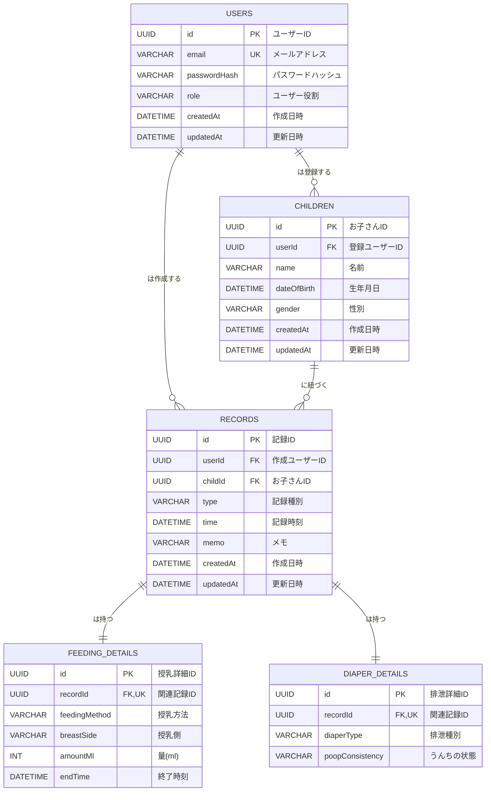

# Web サービス「Sweet Sprouts」データベース設計書

## 1\. 概要

本ドキュメントは、Web サービス「Sweet Sprouts」の永続データを格納するためのデータベーススキーマを定義します。PostgreSQL をリレーショナルデータベースとして採用し、Prisma ORM を用いてスキーマを管理します。ユーザー、お子さん、および各種育児記録（授乳、排泄）の情報を効率的かつ整合性高く管理するためのテーブル構造とリレーションシップを詳述します。

## 2\. テーブルの定義

### 2.1. `User` テーブル (ユーザー情報)

システムを利用するユーザーの基本情報を格納します。ユーザーの役割を定義する `role` カラムを含みます。

| フィールド名   | データ型          | 制約                                        | 説明                                           |
| :------------- | :---------------- | :------------------------------------------ | :--------------------------------------------- |
| `id`           | `String` (`UUID`) | `@id`, `@default(uuid())`, `@@map("users")` | ユーザーを一意に識別する UUID                  |
| `email`        | `String`          | `@unique`                                   | ユーザーのメールアドレス（ログイン用）         |
| `passwordHash` | `String`          | `@@map("password_hash")`                    | パスワードのハッシュ値                         |
| `role`         | `String`          | `@default("GUARDIAN")`                      | ユーザーの役割 (`ADMIN`, `GUARDIAN`, `VIEWER`) |
| `createdAt`    | `DateTime`        | `@default(now())`                           | レコード作成日時                               |
| `updatedAt`    | `DateTime`        | `@updatedAt`                                | レコード最終更新日時                           |

### 2.2. `Child` テーブル (お子さん情報)

複数のお子さんを管理するためのテーブルです。各お子さんは 1 人のユーザーに紐づきます。

| フィールド名  | データ型          | 制約                                           | 説明                                                        |
| :------------ | :---------------- | :--------------------------------------------- | :---------------------------------------------------------- |
| `id`          | `String` (`UUID`) | `@id`, `@default(uuid())`, `@@map("children")` | お子さんを一意に識別する ID                                 |
| `userId`      | `String`          | `@map("user_id")`                              | このお子さんを登録したユーザーの ID (`User.id`への外部キー) |
| `name`        | `String`          |                                                | お子さんの名前                                              |
| `dateOfBirth` | `DateTime`        | `?` (nullable)                                 | 生年月日（日付のみ利用）                                    |
| `gender`      | `String`          | `?` (nullable)                                 | 性別 (`MALE`, `FEMALE`, `UNKNOWN`などを想定)                |
| `createdAt`   | `DateTime`        | `@default(now())`                              | レコード作成日時                                            |
| `updatedAt`   | `DateTime`        | `@updatedAt`                                   | レコード最終更新日時                                        |

### 2.3. `Record` テーブル (記録の共通情報)

授乳記録と排泄記録に共通する情報を格納します。特定のお子さん (`childId`) に紐づきます。

| フィールド名 | データ型          | 制約                                          | 説明                                                   |
| :----------- | :---------------- | :-------------------------------------------- | :----------------------------------------------------- |
| `id`         | `String` (`UUID`) | `@id`, `@default(uuid())`, `@@map("records")` | 記録を一意に識別する ID                                |
| `userId`     | `String`          | `@map("user_id")`                             | 記録を作成したユーザーの ID (`User.id`への外部キー)    |
| `childId`    | `String`          | `@map("child_id")`                            | この記録が紐づくお子さんの ID (`Child.id`への外部キー) |
| `type`       | `String`          |                                               | 記録の種類 (`FEEDING`, `DIAPER`)                       |
| `time`       | `DateTime`        |                                               | 記録発生時刻 (授乳の場合は開始時刻)                    |
| `memo`       | `String`          | `?` (nullable)                                | 記録に関する自由なメモ                                 |
| `createdAt`  | `DateTime`        | `@default(now())`                             | レコード作成日時                                       |
| `updatedAt`  | `DateTime`        | `@updatedAt`                                  | レコード最終更新日時                                   |

### 2.4. `FeedingDetail` テーブル (授乳記録の詳細情報)

授乳記録に特化した詳細情報を格納します。`Record` テーブルの `time` を開始時刻とし、別途 `endTime` を持ちます。

| フィールド名    | データ型          | 制約                                                  | 説明                                                   |
| :-------------- | :---------------- | :---------------------------------------------------- | :----------------------------------------------------- |
| `id`            | `String` (`UUID`) | `@id`, `@default(uuid())`, `@@map("feeding_details")` | 授乳詳細を一意に識別する ID                            |
| `recordId`      | `String`          | `@unique`, `@map("record_id")`                        | 関連する `Record.id` への外部キー                      |
| `feedingMethod` | `String`          | `@map("feeding_method")`                              | 授乳方法 (`DIRECT_BREAST`, `PUMPED_BREAST`, `FORMULA`) |
| `breastSide`    | `String`          | `?` (nullable), `@map("breast_side")`                 | 直接授乳の左右 (`LEFT`, `RIGHT`, `BOTH`)               |
| `amountMl`      | `Int`             | `?` (nullable), `@map("amount_ml")`                   | ミルク/搾乳の量 (ml)                                   |
| `endTime`       | `DateTime`        | `@map("end_time")`                                    | 授乳記録の終了時刻                                     |

### 2.5. `DiaperDetail` テーブル (排泄記録の詳細情報)

排泄記録に特化した詳細情報を格納します。

| フィールド名      | データ型          | 制約                                                 | 説明                                                 |
| :---------------- | :---------------- | :--------------------------------------------------- | :--------------------------------------------------- |
| `id`              | `String` (`UUID`) | `@id`, `@default(uuid())`, `@@map("diaper_details")` | 排泄詳細を一意に識別する ID                          |
| `recordId`        | `String`          | `@unique`, `@map("record_id")`                       | 関連する `Record.id` への外部キー                    |
| `diaperType`      | `String`          | `@map("diaper_type")`                                | 排泄の種類 (`POOP`, `PEE`)                           |
| `poopConsistency` | `String`          | `?` (nullable), `@map("poop_consistency")`           | うんちの状態 (`SOLID`, `LOOSE`, `DIARRHEA`, `OTHER`) |

## 3\. リレーションシップ (ER 図)

Prisma スキーマ定義の記法（1 対多、1 対 1）と、各テーブルに存在する外部キーを示した ER 図です。

- **ER 図の読み方**:
  - `||--o{`: 1 対多 (例: USERS 1 人に対して CHILDREN 複数)
  - `||--||`: 1 対 1 (例: RECORDS 1 つに対して FEEDING_DETAILS 1 つ)
  - `PK`: Primary Key (主キー)
  - `FK`: Foreign Key (外部キー)
  - `UK`: Unique Key (ユニークキー)

## 4\. Prisma スキーマ定義の考慮点

- **UUID の使用**: すべての主キーに UUID (`String`型で`@default(uuid())`) を採用し、分散システムでの ID 衝突リスクを低減します。
- **キャメルケースとスネークケースのマッピング**: Prisma のモデルフィールドは TypeScript の慣習に合わせてキャメルケースで定義し、データベースの実際のカラム名やテーブル名は`@map`アトリビュートを用いてスネークケースにマッピングします。
- **タイムスタンプ**: `createdAt` と `updatedAt` フィールドは Prisma の`@default(now())`と`@updatedAt`を使用して自動で管理されます。
- **リレーションシップ**: `@relation`アトリビュートを使用して、モデル間のリレーションシップを明確に定義します。特に 1 対 1 のリレーションでは、外部キーに`@unique`制約を付けることでその性質を保証します。`onDelete: Cascade` を設定することで、親レコードが削除された際に子レコードも自動的に削除されるようにし、データの整合性を保ちます。

## 5\. PostgreSQL での実装

Prisma ORM は、このスキーマ定義を基に PostgreSQL データベースのテーブルを自動で生成・管理します。`prisma migrate` コマンドを通じて、スキーマの変更を安全にデータベースに適用することが可能です。

---
